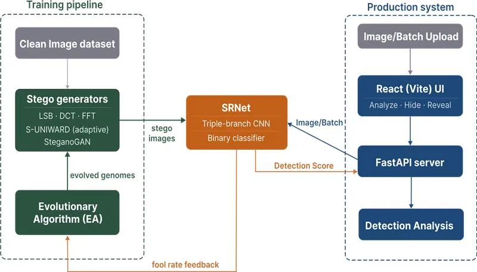
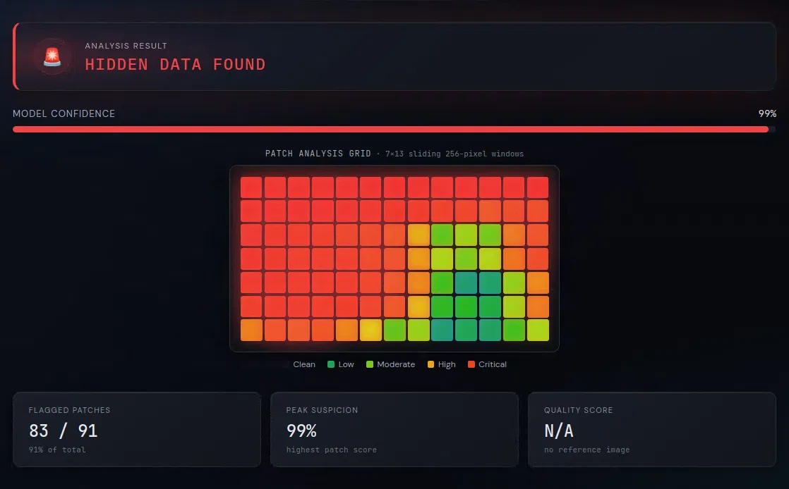
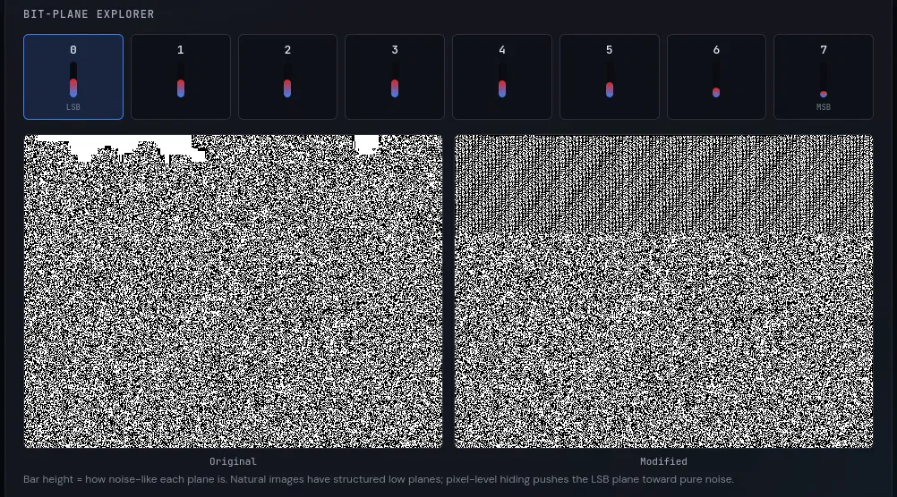

# StegAnalysis - AI-Powered Steganography Detection

> Final engineering project, B.Sc. Software Engineering, Afeka College of Engineering.
> Developed with the guidance of Israel's National Cyber Directorate.

Someone can hide a message inside an ordinary-looking photo, and nothing about
the image looks different to the eye. **StegAnalysis takes any image and
estimates whether something is hidden inside it - and if so, where.**

Unlike tools that target a specific embedding method, it does not need to be
told which technique was used. It is built around a convolutional neural network
(**SRNet**) trained adversarially against an evolutionary algorithm that
continuously breeds new steganography techniques to fool it, and served through
a FastAPI backend and a React web app.



---

## Contents

- [What it does](#what-it-does)
- [Results](#results)
- [Quick start](#quick-start)
- [Repository layout](#repository-layout)
- [Steganography methods](#steganography-methods)
- [The detector](#the-detector)
- [How it was trained](#how-it-was-trained)
- [API reference](#api-reference)
- [Frontend](#frontend)
- [Testing](#testing)
- [Model checkpoints](#model-checkpoints)
- [Glossary](#glossary)
- [Key code references](#key-code-references)
- [Credits & licence](#credits--licence)

---

## What it does

Three user-facing flows, all backed by the same detector:

| Flow | The user provides | The system returns |
|---|---|---|
| **Analyze** | Any image | A suspicion score, a heatmap showing *where* the suspicion is, a residual view of what the model reacts to, and a frequency spectrum |
| **Embed** | An image + a message | The message encrypted and hidden inside the image, with image-quality (PSNR) and capacity figures |
| **Extract** | A stego image + passphrase | The recovered message - the hiding method is detected automatically |

The interface is written for a non-technical audience: no machine-learning
jargon is shown to the user.



---

## Results

Evaluated on **third-party test images the model never saw during training**
(public Kaggle steganography sets), using the
deployed operating point.

| Target | Detection rate |
|---|---|
| Clean images correctly cleared | **96.4%** |
| LSB | **100.0%** |
| DCT | **97.5%** |
| FFT | **97.5%** |
| SteganoGAN | **88.0 – 97.5%** |
| S-UNIWARD @ 0.4 bpp  | 14.3% |
| S-UNIWARD @ 0.2 bpp  | 1.9% |
| **Balanced accuracy**  | **97.4%** |

 Content-adaptive embedding - see the limitation below.
 Computed over clean images and the three classical methods; **excludes the
two S-UNIWARD rows**, which are reported separately rather than averaged away.

Detection is essentially saturated on the three classical methods and strong on
GAN-generated stego. Because the test images and the embedding tools that
produced them were not used in training, these figures indicate generalization
beyond our own generators.

### Known limitation: content-adaptive embedding

S-UNIWARD remains the main limitation of the current detector. The
steganographic signal is present but faint: stego images do score higher than
their matched cover images, and consistently so as the payload grows, but at low
payloads the margin is too small to cross the deployed decision threshold, which
is set to keep false alarms on clean images. Loosening that threshold raises
0.4 bpp detection to roughly 47%, at the cost of dropping clean-image accuracy
to 84%.

Low-payload content-adaptive steganography is a recognized open problem in the
steganalysis literature.

---

## Quick start

**Prerequisites:** Python 3.10+, Node 18+. A GPU is recommended for training;
detection runs fine on CPU.

```bash
# 1. Environment (venv + CUDA PyTorch + dependencies + smoke test)
./setup.sh
source .venv/bin/activate

# 2. Backend
uvicorn api.server:app --reload --port 8000

# 3. Frontend (second terminal)
cd frontend && npm install && npm run dev     # http://localhost:5173
```

---

## Repository layout

```
├── setup.sh              # environment bootstrap
├── main.py               # training entry point
├── test_kaggle.py        # evaluation against third-party test sets
│
├── models/srnet.py       # the detector architecture
│
├── generators/           # the five steganography methods
│   ├── lsb_gen.py
│   ├── dct_gen.py
│   ├── fft_gen.py
│   ├── adaptive_gen.py       # S-UNIWARD
│   ├── steganogan_gen.py
│   └── unified_generator.py  # dispatcher
│
├── training/
│   ├── config.py         # all hyperparameters live here
│   ├── train_hybrid.py   # adversarial training loop
│   ├── evolution.py      # the evolutionary algorithm
│   ├── batch.py          # batch construction with diversity guarantees
│   ├── evaluate.py       # per-method offline evaluation
│   └── finetune.py
│
├── payload/              # encrypted message codec
├── api/server.py         # FastAPI application
├── tests/                # backend pytest suite
│   ├── test_api.py
│   ├── test_codec.py
│   ├── test_crypto.py
│   ├── test_generators.py
│   └── nonfunctional/    # performance, reliability, security, extensibility
├── docs/screenshots/     # README images
└── frontend/             # React + Vite web application
```

---

## Steganography methods

Five embedding families are implemented. Capacity is expressed as true
**bits per pixel (bpp)** across all of them.

| Method | Where it hides data | Message recoverable |
|---|---|---|
| **LSB** | The least-significant bit of each pixel | ✅ |
| **DCT** | JPEG-style 8×8 block frequency coefficients | ✅ |
| **FFT** | Global frequency bands of the whole image | ✅ |
| **S-UNIWARD** | Adaptively, in noisy and textured regions | ❌ |
| **SteganoGAN** | Wherever a trained neural encoder chooses | ❌ |

The first three carry a real, recoverable message. S-UNIWARD and SteganoGAN
embed random data - they exist to generate realistic training material for the
detector and are presented in the UI as non-recoverable.

**S-UNIWARD** follows the reference formulation (Daubechies-8 back-convolution
cost model), with embedding strength solved against ternary entropy so that the
requested bpp is genuine. Calibration was verified against reference files:
0.20 bpp changes ~3.2% of pixels at ~63 dB PSNR.

---

## The detector

**SRNet** is a triple-branch residual network. Each 256×256 patch is represented
using both spatial and frequency-domain (log-FFT) information, and three
parallel branches process these representations:

| Branch | Filters | Reads | Purpose |
|---|---|---|---|
| A | 11, **frozen** SRM kernels | spatial | fixed high-pass noise-residual filters |
| B | 53, learnable | spatial | learned spatial residuals |
| C | 21, learnable | log-FFT | frequency-domain artifacts |

Their outputs concatenate into an 85-channel map, pass through ten residual
stages, and end in global average pooling and a binary classifier.

Whole images are scanned with a **256×256 sliding window** and the per-window
probabilities are reduced to a single score by taking the maximum - a hidden
message may occupy only part of an image, so the most suspicious region governs
the verdict.

> The detector is trained on image **luminance** only. All inference paths
> convert to grayscale first. feeding raw colour channels is out-of-distribution
> and degrades accuracy badly.



---

## How it was trained

The detector is trained together with an evolutionary population of generator
*genomes* - each a steganography method plus its parameters. Every generation
embeds data into cover images, trains the detector on the result, and then
breeds and mutates the genomes to maximise their success at fooling the
*current* detector. Detector and adversaries improve together.

Left unchecked, this loop degenerates: the population collapses onto whichever
single technique currently fools the detector best, and the detector then
forgets the techniques that have stopped appearing. Three mechanisms prevent
this:

- **Batch ceilings** - cap how many slots any one niche or family may occupy, so
  no single technique dominates a batch.
- **Batch floors** - reserve a fixed share of every batch for the hardest cases
  (S-UNIWARD, SteganoGAN, low-payload embeddings), so no family can vanish and
  be forgotten.
- **Capacity penalty** in the fitness function - prevents the algorithm from
  "winning" trivially by driving every technique to its lowest, least detectable
  payload.

During fine-tuning the evolutionary search is switched off entirely and replaced
by a sampler that weights each technique by how badly the detector currently
handles it.

```bash
python main.py                                   # full training run
python training/evaluate.py                      # per-method evaluation
python training/finetune.py --steganogan-focus   # focused fine-tune
```

All hyperparameters live in [`training/config.py`](training/config.py).

---

## API reference

FastAPI server on `http://localhost:8000`. Plain HTTP REST.

| Endpoint | Purpose |
|---|---|
| `POST /api/analyze` | Detection - confidence, per-window scores, and visualisation URLs |
| `POST /api/embed` | Hide a message - returns the stego image, PSNR and capacity |
| `POST /api/extract` | Recover a hidden message, auto-detecting the method |
| `POST /api/decrypt` | Decrypt an already-extracted payload (two-step reveal) |
| `POST /api/capacity` | Maximum message size for a given image and method |
| `GET /health` | Liveness probe |

Image endpoints, all returning PNG for a given `job_id`: `/api/original`,
`/api/stego`, `/api/heatmap`, `/api/noisemap`, `/api/spectrum`, `/api/diff`,
`/api/bitplane/{n}`, `/api/sanitize`.

**Payload format.** `payload/codec.py` prefixes the ciphertext with a
self-describing header (magic number, method, cipher, length, salt, nonce,
parameters and a CRC-32 checksum), so an extractor can identify and validate a
payload without being told how it was made. Encryption is authenticated
(AES-256-GCM, ChaCha20-Poly1305 or Fernet), so a wrong passphrase is reported as
such rather than returning garbage.

---

## Frontend

React 18 + Vite. Separate flows for analysis, embedding and extraction, plus a
`/learn` page explaining the concepts, in a dark high-contrast interface. All
network calls go through a centralised API client (`src/api/client.js`).

---

## Testing

```bash
# Backend - payload codec, crypto, all 5 generators, and the live API endpoints
source .venv/bin/activate
pytest

# Frontend - config, hooks, and components
cd frontend && npm test
```

141 backend tests, 56 frontend tests (197 total). Backend tests run the real
SRNet checkpoint and generators on CPU - no GPU or external dataset required.

---

## Model checkpoints

| File | What it is |
|---|---|
| `srnet_steganogan_best.pth` | **Current best** - the deployed detector |
| `srnet_finetuned_best.pth` | Previous checkpoint, the base the above was fine-tuned from |
| `srnet_best_val.pth` | Best validation checkpoint from the last full training run |
| `steganogan_dense.pth` | Converted SteganoGAN encoder weights |

Per-epoch checkpoints and JSON training histories are also committed, so any
reported figure can be reproduced.

> `models/srnet.py` is treated as frozen - changing the architecture invalidates
> every checkpoint above.

---

## Glossary

| Term | Meaning |
|---|---|
| **Cover / stego** | An image before hiding data / the same image after |
| **bpp** | Bits per pixel - how much data is hidden, relative to image size |
| **Genome** | One generator configuration: an embedding method plus its parameters |
| **Fool rate** | Share of a genome's stego images that the detector scores as clean |

---

## Key code references

Permalinks below are pinned to commit
[`b84900d`](https://github.com/ItayChabra/StegAnalysis/commit/b84900d0824061fb849bf15a940655ab909a8d83)
so the line numbers stay stable regardless of later commits on this branch.

### Detection & inference

- **SRNet architecture** - [`models/srnet.py#L6-L127`](https://github.com/ItayChabra/StegAnalysis/blob/b84900d0824061fb849bf15a940655ab909a8d83/models/srnet.py#L6-L127)
  The complete detection model: triple-branch frontend and the residual stack
  feeding a binary classifier. Every other component exists to train or query it.
- **Sliding-window inference** - [`api/server.py#L143-L196`](https://github.com/ItayChabra/StegAnalysis/blob/b84900d0824061fb849bf15a940655ab909a8d83/api/server.py#L143-L196)
  Turns a patch-level classifier into a whole-image verdict: 64-pixel-stride
  scan across the image, then max-reduction of the per-patch scores to a
  single verdict.

### Adversarial-evolutionary training

- **Unified Generator dispatcher** - [`generators/unified_generator.py#L24-L52`](https://github.com/ItayChabra/StegAnalysis/blob/b84900d0824061fb849bf15a940655ab909a8d83/generators/unified_generator.py#L24-L52)
  The single call site through which every genome becomes a stego image,
  decoupling the evolutionary search - which only manipulates parameter dicts -
  from the five embedding implementations.
- **Fitness function** - [`training/evolution.py#L191-L212`](https://github.com/ItayChabra/StegAnalysis/blob/b84900d0824061fb849bf15a940655ab909a8d83/training/evolution.py#L191-L212)
  Fool rate minus a penalty that ramps up as payload capacity falls below a
  per-method threshold. This is the in-loop score driving genome selection every
  generation - distinct from the offline min-AUC reported by
  `training/evaluate.py`.
- **Diversity-aware batch construction** - [`training/batch.py#L51-L99`](https://github.com/ItayChabra/StegAnalysis/blob/b84900d0824061fb849bf15a940655ab909a8d83/training/batch.py#L51-L99) (floors), [`#L101-L129`](https://github.com/ItayChabra/StegAnalysis/blob/b84900d0824061fb849bf15a940655ab909a8d83/training/batch.py#L101-L129) (ceilings)
  Bounds every batch from both directions: floors reserve 25% of slots for
  S-UNIWARD, 12% for SteganoGAN and 15% of the remainder for low-capacity
  genomes before any EA-driven genome is drawn; ceilings then cap how many slots
  any one niche or family may take. Because the dispatcher can regenerate a
  stego image from any genome on demand, the floors act as *generative* replay
  against catastrophic forgetting.
- **Performance-weighted sampler** - [`training/finetune.py#L103-L142`](https://github.com/ItayChabra/StegAnalysis/blob/b84900d0824061fb849bf15a940655ab909a8d83/training/finetune.py#L103-L142) (min-AUC table + loader), [`#L184-L204`](https://github.com/ItayChabra/StegAnalysis/blob/b84900d0824061fb849bf15a940655ab909a8d83/training/finetune.py#L184-L204) (`_build_sampler`)
  Replaces the EA during fine-tuning: sampling weight per strategy is
  proportional to `1 - its last measured min-AUC`, with a hard floor. The
  min-AUC table is loaded from evaluate.py's own output when available,
  falling back to a hardcoded snapshot otherwise, so a fresh evaluation run
  is picked up automatically. Static quotas alone proved insufficient -
  letting the highest-fool-rate generator dominate collapsed validation
  accuracy from 83% to 63%.

---

## Credits & licence

Released under the MIT licence - see [`LICENSE`](LICENSE).

- **SteganoGAN** - networks under `generators/steganogan_src/` are vendored from
  [DAI-Lab/SteganoGAN](https://github.com/DAI-Lab/SteganoGAN), MIT licence,
  © 2019 MIT Data To AI Lab.
- **S-UNIWARD** - cost model after Holub, Fridrich & Denemark, *Universal
  distortion function for steganography in an arbitrary domain* (2014).
- **SRNet** - architecture after Boroumand, Chen & Fridrich, *Deep residual
  network for steganalysis of digital images* (2019).
- **Datasets** - BOSSbase 1.01, BOWS2, Flickr30k, and public Kaggle
  steganography test sets. Image data is not committed to the repository.

Development conventions and internal notes are in [`CLAUDE.md`](CLAUDE.md).